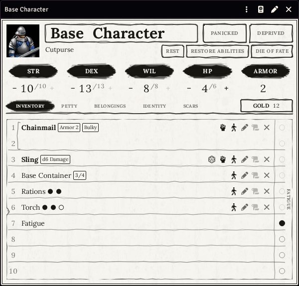
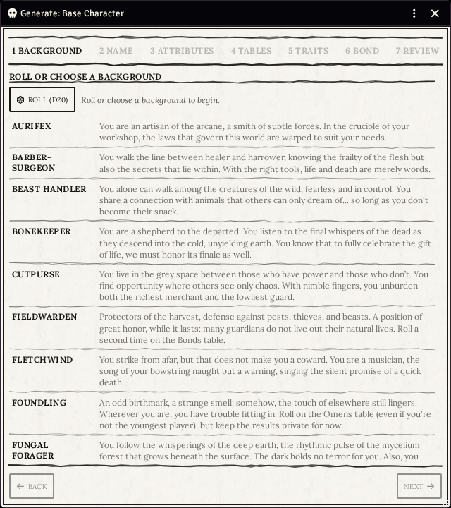
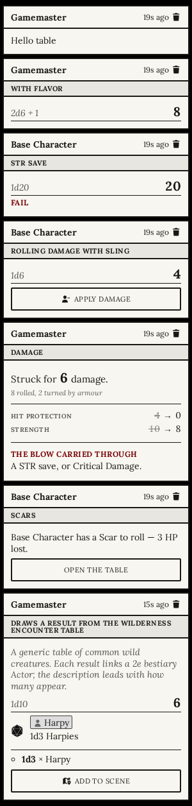
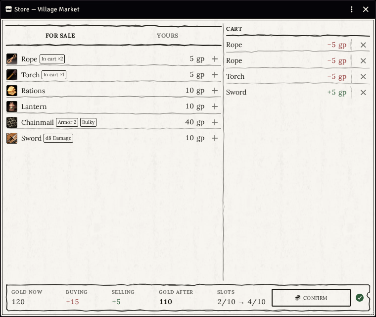
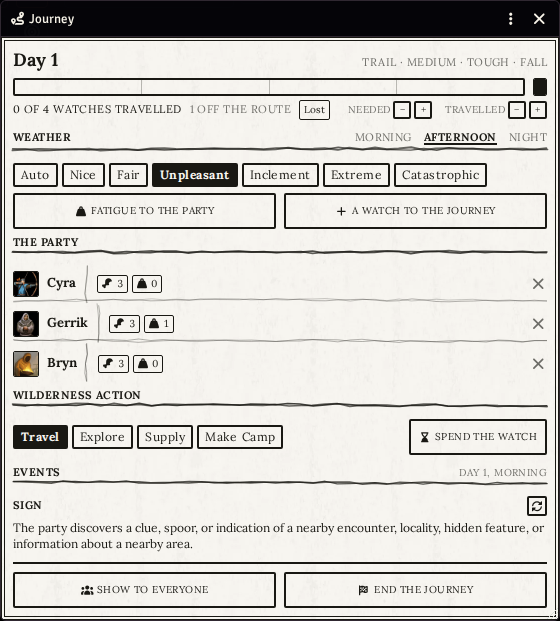
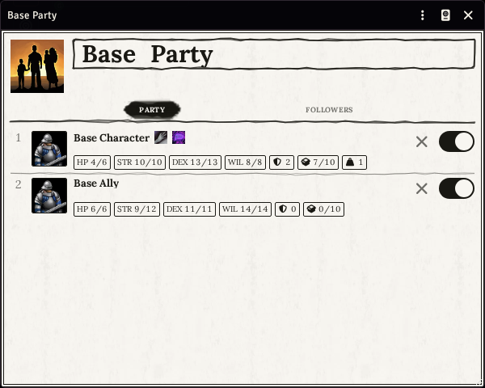
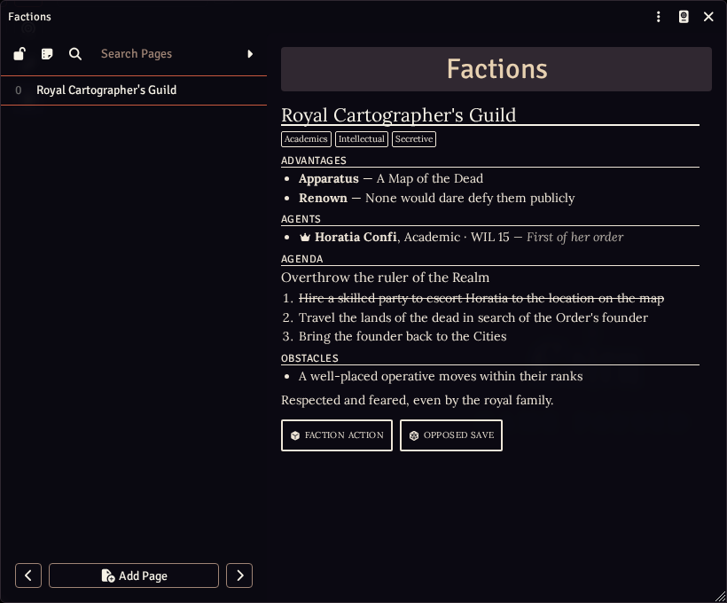

# Cairn 2e for Foundry VTT

**Dark fantasy survival, ready to play at your virtual table.**

[Cairn](https://cairnrpg.com) is a rules-light tabletop RPG by Yochai Gal about adventurers
exploring a dangerous, mysterious forest. Characters are fragile, gear matters, and every choice
counts. This system brings **Cairn Second Edition** to [Foundry VTT](https://foundryvtt.com), and
it handles the bookkeeping so your table can focus on the story.

<p align="center">
  
  
</p>


[](https://buymeacoffee.com/mestredigital) [](https://mestredigital.online/pages/projetos-en)

---

## Why you'll like it

### A character in five minutes
Pick one of the **20 backgrounds**, such as Aurifex, Bonekeeper or Fungal Forager, or let the
dice pick one. The creator walks you through it step by step: a name from the background's own
list, attributes, starting gear, personality traits, a Bond and an Omen. Anything you leave blank
is rolled for you. Already built your character on [Kettlewright](https://kettlewright.com)?
Import it with one click.

### A sheet that plays like the book
Ten inventory slots, where heavy (*bulky*) items take two and Fatigue fills them up. Click STR,
DEX or WIL to make a save. Rest, Restore and the **Die of Fate** are one button each. Armor adds
itself up from what you wear. When a character is overloaded or panicking, the sheet shows it.

### Combat that does the math for you
Roll damage and apply it to the targeted token. Armor soaks what it can, HP goes first, the rest
spills into STR, and the sheet asks for the critical-damage save when it's due. Scars, Panic,
*impaired* and *enhanced* attacks, *blast*, Morale and Reactions are all handled. The combat
tracker follows Cairn's rules: sides take turns, with no initiative roll.

<p align="center">
  
  
</p>

### A toolbox for the Warden
- **One-click generators** for NPCs, hirelings, monsters and whole factions, all built from the
  rulebook's own tables.
- **Journeys**: a shared travel window where the party votes on each watch's action. It rolls
  weather, getting lost and wilderness events, and an encounter can drop its creatures straight
  onto the map.
- **Stores**: stock a market by dragging items onto its shelves and open it on every player's
  screen. Players fill a cart, and the store checks both their gold *and* their free slots before
  anything changes hands.
- **Factions** that play: agents in rank order, an agenda to tick off, and buttons for faction
  actions and opposed saves.
- **A party sheet** that shows everyone's HP, attributes and load at a glance, plus the followers
  travelling with them.
- **Live rules in your notes**: write `[[/save WIL]]` in a journal and it becomes a clickable
  save. When a character dies, you can promote a hireling to a player character.

<p align="center">
  
  
</p>
<p align="center">
  
</p>

### Everything in the box
All the game content you need is already inside:

| | |
|---|---|
| **Backgrounds** | all 20, with their name lists, starting gear and tables |
| **Equipment** | the full Marketplace (gear, weapons, armor), plus carts, horses, mules and wagons |
| **Magic** | 100 spellbooks, 100 scrolls and 46 relics |
| **Bestiary** | 84 ready-to-drop monsters, plus 13 hirelings |
| **Tables** | traits, Bonds, Omens, Scars, Reactions, the Die of Fate and the Warden's generator tables |
| **Macros** | Die of Fate, Rest, Restore Abilities, Roll Morale, Roll Reaction, and STR / DEX / WIL saves |
| **Homebrew** | *More Gear*, *More Spellbooks* and *More Scrolls*: extra content by the maintainer, kept in its own folder |

### It looks like the books
The ink-on-paper design uses **Lora**, the typeface the Cairn books are set in. A new world opens
on a welcome scene with its own music. With
[Dice So Nice](https://foundryvtt.com/packages/dice-so-nice) installed, you roll a custom 3D
Cairn d20.

---

## Installation

In Foundry's setup screen, go to **Game Systems → Install System**, paste this into
**Manifest URL**, and click **Install**:

```
https://github.com/brunocalado/cairn2e/releases/latest/download/system.json
```

Then create a world with the **Cairn 2e** system. If you want players to build their own
characters, open **Configure Settings → Permissions** and allow **Create Actor** for players.

**Recommended modules** (optional):
- [Dice So Nice](https://foundryvtt.com/packages/dice-so-nice) rolls the 3D Cairn d20.
- [Light Sources](https://github.com/brunocalado/light-sources) lights torches, lanterns and
  candles from the token HUD and spends their uses.

## Learn more

The [**user guide**](docs/wiki.md) covers everything in detail: the character creator, the
sheet, rolling in play, every Warden tool, containers, and the API for macro and module authors.

Found a bug or have an idea? [Open an issue](https://github.com/brunocalado/cairn2e/issues).
Changes in each version are listed in the [changelog](CHANGELOG.md).

---

## Licence

- **Code:** [GNU GPL v3](LICENSE).
- **Cairn:** the Cairn 2e SRD by Yochai Gal, used under
  [CC BY-SA 4.0](https://creativecommons.org/licenses/by-sa/4.0/).
- **Assets:** [assets](docs/CREDITS.md).
