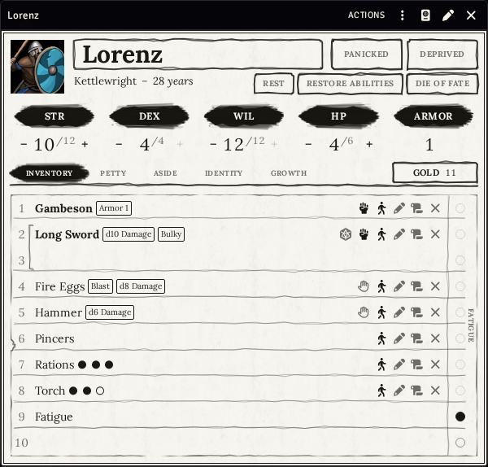
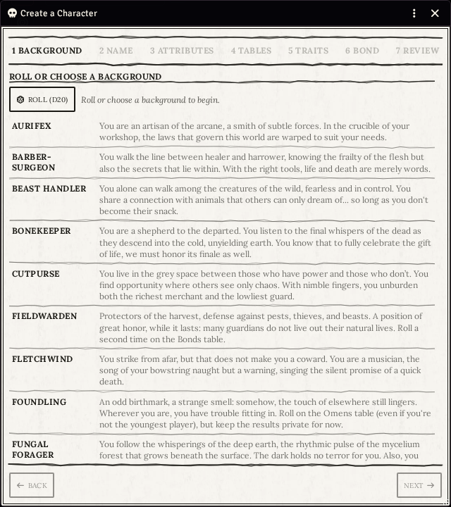
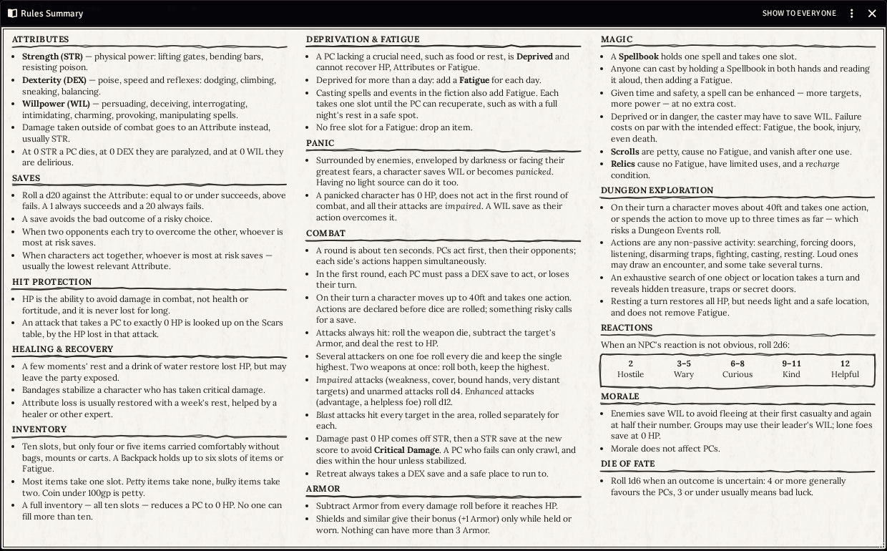
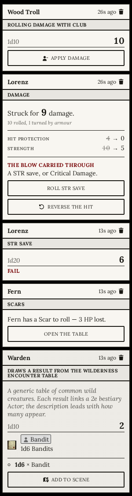
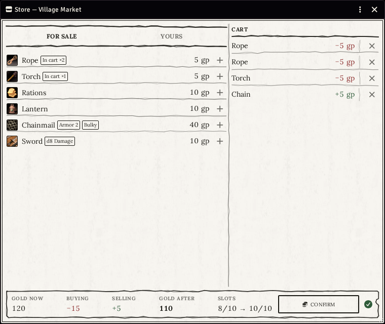
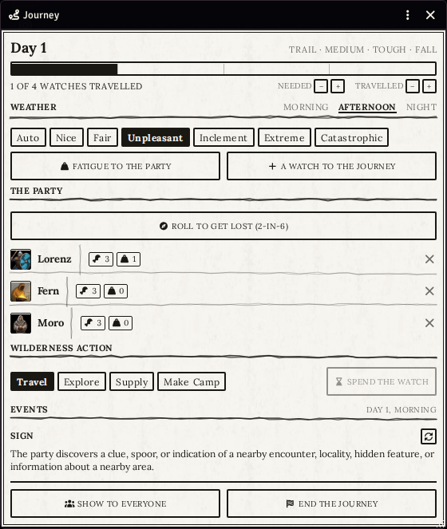
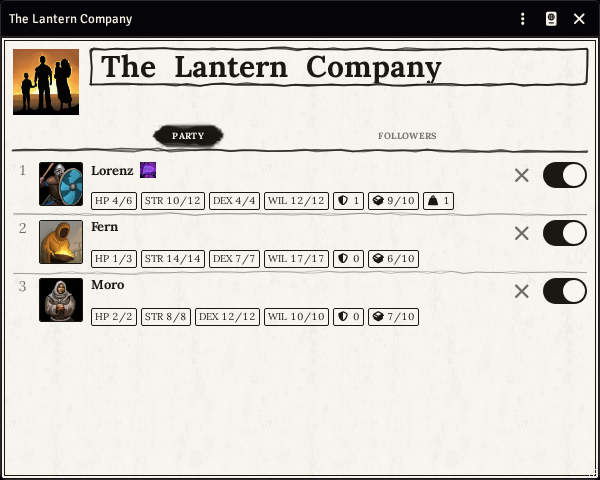
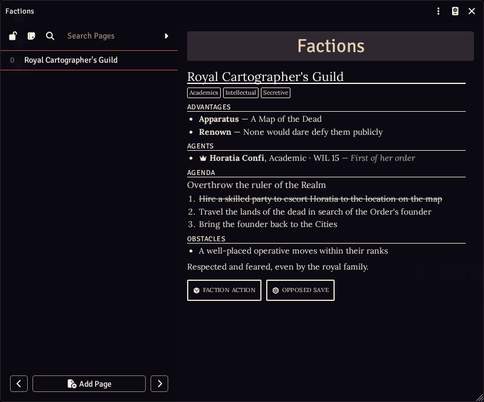
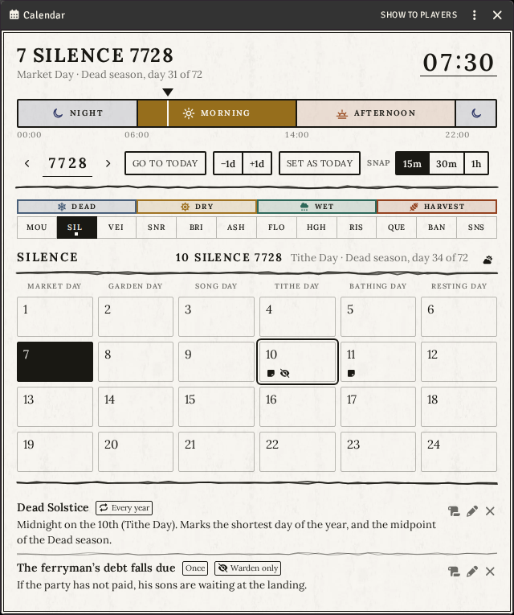
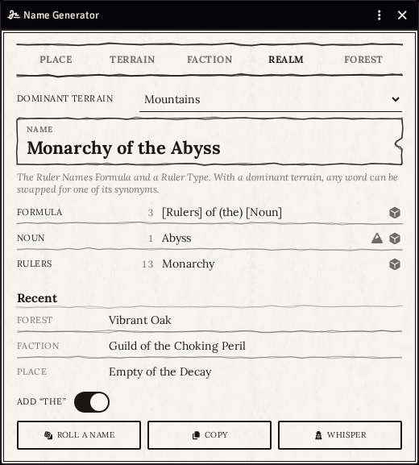

# Cairn 2e for Foundry VTT

**Dark fantasy survival, ready to play at your virtual table.**

[Cairn](https://cairnrpg.com) is a rules-light tabletop RPG by Yochai Gal about adventurers
exploring a dangerous, mysterious forest. Characters are fragile, gear matters, and every choice
counts. This system brings **Cairn Second Edition** to [Foundry VTT](https://foundryvtt.com), and
it handles the bookkeeping so your table can focus on the story.

<p align="center">
  
  
</p>


[](https://buymeacoffee.com/mestredigital) [](https://mestredigital.online/pages/projetos-en)

---

## Why you'll like it

### A character in five minutes
Pick one of the **20 backgrounds**, such as Aurifex, Bonekeeper or Fungal Forager, let the
dice pick one, or choose one the Warden wrote for the campaign. The creator walks you through it step by step: a name from the background's own
list, attributes, starting gear, personality traits, a Bond and an Omen. Anything you leave blank
is rolled for you. Already built your character on [Kettlewright](https://kettlewright.com)?
Import it with one click.

### A sheet that plays like the book
Ten inventory slots, where heavy (*bulky*) items take two and Fatigue fills them up. Fists, claws
and anything else that is part of the body cost no slot, and every character starts with their
fists. Click STR, DEX or WIL to make a save. Rest, Restore and the **Die of Fate** are one button each. Armor adds
itself up from what you wear. When a character is overloaded or panicking, the sheet shows it.

The **Actions** menu lets a player **Whisper** in character, **Barter** gear and coin with another
player's character, open the one-page **Rules Summary** or the **Calendar**, and run the macros
the Warden has put there. Drag a sack or a cart onto another sheet you own, such as your mule's,
and everything inside goes with it. A companion that comes with a background, like the Raven
Familiar, is dragged from its item straight onto the map.

<p align="center">
  
</p>

### Combat that does the math for you
Roll damage and apply it to the targeted token. Armor soaks what it can, HP goes first, the rest
spills into STR, and the chat card offers the critical-damage save when it's due. A fall or a
cave-in rolled on the spot applies the same way, and a hit on the wrong token is undone with one
click. Scars, Panic,
*impaired* and *enhanced* attacks, *blast*, Morale and Reactions are all handled. The combat
tracker follows Cairn's rules: sides take turns, with no initiative roll.

<p align="center">
  
  
</p>

### A toolbox for the Warden
- **One-click generators** for NPCs, hirelings, monsters, whole factions and names for places,
  realms and forests, all built from the rulebook's own tables.
- **A calendar** in the Vald reckoning of the Warden's Guide: watches, seasons, the Reclamation,
  and notes on any day, starting with the setting's holidays. The Warden sets the time and shows
  it to everyone.
- **Journeys**: a shared travel window that runs the wilderness watch by watch. It rolls weather,
  getting lost and wilderness events, spends Rations and Fatigue on everyone's sheet, and an
  encounter can drop its creatures straight onto the map.
- **Dungeons**: the combat tracker runs exploration turn by turn. It shows what each character
  is doing, how far their token moved, and when the rules call for a Dungeon Event. If a fight
  breaks out, the dungeon picks up again on the same turn once it ends.
- **Stores**: ten small ones come ready, from the Weaponsmith to the Tavern. Stock your own by
  dragging items onto its shelves, and open it on every player's screen. Players fill a cart, and the store checks both their gold *and* their free slots before
  anything changes hands.
- **Unknown relics**: a relic can hide behind the name and looks the Warden gives it, unusable
  until it is revealed.
- **Factions** that play: agents in rank order, an agenda to tick off, and buttons for faction
  actions and opposed saves.
- **A party sheet** that shows everyone's HP, attributes and load at a glance, plus the followers
  travelling with them.
- **Live rules in your notes**: write `[[/save WIL]]` in a journal and it becomes a clickable
  save. A trap written as `[[/damage d6 STR]]` rolls its damage against STR instead of HP. When a
  character dies, you can promote a hireling to a player character.

<p align="center">
  
  
</p>
<p align="center">
  
</p>
<p align="center">
  
  
</p>

### Everything in the box
All the game content you need is already inside:

| | |
|---|---|
| **Backgrounds** | all 20, with their name lists, starting gear and tables |
| **Equipment** | the full Marketplace (gear, weapons, armor), plus carts, horses, mules and wagons |
| **Magic** | 100 spellbooks, 100 scrolls and 46 relics |
| **Bestiary** | 84 ready-to-drop monsters, plus 13 hirelings and the 5 companions some backgrounds start with |
| **Tables** | traits, Bonds, Omens, Scars, Reactions, the Die of Fate, Wilderness and Dungeon Events, the naming tables, and the Warden's generator tables |
| **Calendar** | the Vald calendar's 24 holidays, festivals, solstices and equinoxes |
| **Macros** | Die of Fate, Rest, Restore Abilities, Roll Morale, Roll Reaction, STR / DEX / WIL saves, Rules Summary, Calendar, and the Warden's Reset Player Hotbars and Restore Default Stores |
| **Homebrew** | *More Gear*, *More Spellbooks* and *More Scrolls*: extra content by the maintainer, kept in its own folder |

### It looks like the books
The ink-on-paper design uses **Lora**, the typeface the Cairn books are set in. A new world opens
on a welcome scene with its own music, and every player finds the saves, the Die of Fate, Rest,
Restore Abilities, the Rules Summary and the Calendar already on their hotbar. With
[Dice So Nice](https://foundryvtt.com/packages/dice-so-nice) installed, you roll a custom 3D
Cairn d20.

---

## Installation

In Foundry's setup screen, go to **Game Systems → Install System**, search for **Cairn 2e** and
click **Install**. Or paste this into **Manifest URL**:

```
https://github.com/brunocalado/cairn2e/releases/latest/download/system.json
```

Then create a world with the **Cairn 2e** system. If you want players to build their own
characters, open **Configure Settings → Permissions** and allow **Create Actor** for players.

**Recommended modules** (optional):
- [Dice So Nice](https://foundryvtt.com/packages/dice-so-nice) rolls the 3D Cairn d20, and the
  other dice in a Cairn Blood Moon theme that each player can change.
- [Light Sources](https://github.com/brunocalado/light-sources) lights torches, lanterns and
  candles from the token HUD and spends their uses. A lit torch is the torch itself: remove it
  from the sheet and it goes out, hand it to another character and it arrives lit, and a module
  that carries items onto the map, such as Canvas Loot, takes the flame with it.
- [Automated Animations](https://foundryvtt.com/packages/autoanimations), with
  [JB2A Patreon](https://jb2a.com/) and [PSFX](https://github.com/JimHPerry/psfx), animates and
  sounds Cairn's weapons, monster attacks and spells. The system adds its entries to AA's menu
  once, and your edits to them are kept. A world setting turns this off.

## Learn more

The [**user guide**](docs/wiki.md) covers everything in detail: the character creator, the
sheet, rolling in play, every Warden tool, containers, and the API for macro and module authors.

The system is in English. A translation is a separate module: to make one, see
[Translating Cairn 2e](docs/translating.md).

Found a bug or have an idea? [Open an issue](https://github.com/brunocalado/cairn2e/issues).
Changes in each version are listed in the [changelog](CHANGELOG.md).

---

## Licence

- **Code:** [GNU GPL v3](LICENSE).
- **Cairn:** the Cairn 2e SRD by Yochai Gal, used under
  [CC BY-SA 4.0](https://creativecommons.org/licenses/by-sa/4.0/).
- **Assets:** [assets](docs/CREDITS.md).
