# Cairn 2e — user guide

How to play **Cairn Second Edition** on **Foundry VTT v14** with this system: where each button
is and what it does. It is written for the Warden (the game master) and the players alike. It does
not teach the rules: they are in the Cairn 2e books and free online at
[cairnrpg.com](https://cairnrpg.com).

**Contents**

1. [Getting started](#1-getting-started)
2. [Making a character](#2-making-a-character)
3. [The character sheet](#3-the-character-sheet)
4. [Items, magic and containers](#4-items-magic-and-containers)
5. [Rolling dice](#5-rolling-dice)
6. [Damage, Critical Damage and Scars](#6-damage-critical-damage-and-scars)
7. [Combat](#7-combat)
8. [Conditions](#8-conditions)
9. [Growth](#9-growth)
10. [The party](#10-the-party)
11. [Stores and coin](#11-stores-and-coin)
12. [Warden tools](#12-warden-tools)
13. [Journeys through the wilderness](#13-journeys-through-the-wilderness)
14. [Exploring a dungeon](#14-exploring-a-dungeon)
15. [Handy shortcuts in text](#15-handy-shortcuts-in-text)
16. [Macros](#16-macros)
17. [Compendiums](#17-compendiums)

---

## 1. Getting started

### A new world

Create a world on the **Cairn 2e** system and launch it. The first time it opens you get:

- a **Welcome** scene, with its own music;
- the game master seat renamed to **Warden**, which is what Cairn calls it;
- the system's macros in a **Cairn 2e** folder of the Macros directory (see [§16](#16-macros)).

Each player finds their macros on the hotbar the first time they log in: the three saves, the
Die of Fate, the Rules Summary and the Calendar on the left, Rest and Restore Abilities at the far end. Only
empty slots are filled, and only once.

If players should build their own characters, open **Configure Settings → Permissions** and allow
**Create Actor** for the Player role.

### The Cairn 2e tab

The system adds its own tab to the right-hand sidebar, **Cairn 2e** (the skull icon). Its buttons
depend on who you are:

| Section | Who sees it | Buttons |
|---|---|---|
| **Characters** | anyone allowed to create actors | Generate character · Import from Kettlewright |
| **Generators** | the Warden only | Generate NPC · Generate Hireling · Generate Name · Generate Monster · Generate Faction · Treasure |
| **Campaign** | the Warden only | Calendar · Journey · Store |
| **Reference** | the Warden only | Rules Summary |

A player who cannot create actors does not see the tab at all, and doesn't need it.

### The calendar and the watch

Foundry's world clock speaks the **Vald calendar** of the Warden's Guide: twelve months of 24 days,
a six-day week from Market Day to Resting Day, four seasons of 72 days, and the six-day
**Reclamation** after Sunset in every year ending in 0. A new world starts on **1 Mourning 7728**,
at 06:00. Each season begins on the 1st of its first month (Mourning, Sunrise, Flood, Quell), a
table decision: the SRD's own dates for them cannot all give the 72 days it states.

The **Calendar** window shows today, the **watch**, the year and the month. A day in Cairn is three
watches, morning (from 06:00), afternoon (from 14:00) and night (from 22:00), drawn as a dial of
the date from midnight to midnight — night in two pieces, its small hours at the left and its
first two hours at the right — with the current watch filled and a needle at the exact time. Everyone can open it, from the
**Calendar** button in the Notes controls (left of the map, while a scene is shown), the
**Calendar** macro on the hotbar, or **Actions → Calendar** on the character sheet. Players browse
any month of any year and change nothing: the year's arrows and **Go to today** are on the toolbar
under the dial.

The **Warden** also:

- drags the needle by its head along the dial to set the hour, in steps of the **Snap** on the
  toolbar (15 m, 30 m or 1 h, remembered in that browser). The needle never changes the date:
  left is earlier in the day, right is later. The time is set when the needle is let go, and
  Escape puts it back;
- types the time into the clock at the top right;
- changes the date with **−1d** and **+1d** on the toolbar (same time of day), or selects a day
  and presses **Set as today**;
- clicks a watch on the dial to move on to its next start, or the filled one to go back to its
  start;
- right-clicks a day for **Make this today** (same time of day);
- presses **Show to players**, on the window's title bar, to open everyone's calendar on the day
  the Warden is looking at.

**Notes.** The day under the month grid lists the notes on it: a sticky note on a day means a note
everyone sees, a struck-out eye a note only the Warden sees, and a note that comes back every year
carries the repeat arrows on its tag. Anyone who can read a note can post it to
chat with the scroll; a Warden-only note posts to the Wardens alone. The Warden right-clicks a day
for **Add a note**: a title, the day it starts, **Every year** or one year only, how many days it
lasts, whether **everyone** sees it, and plain text. Each note is a journal entry in the
**Calendar notes** folder, so it can also be opened from the Journal tab. A new world starts with
the 24 holidays, festivals, solstices and equinoxes of the Vald calendar as notes everyone sees;
the Warden can edit, hide or delete them like any other. A deleted one is back with one drag from
the **Vald Calendar** compendium. A note hidden from players is kept out of their windows, not off
their computers: a player who opens the console can read it.

**Weather.** The cloud after the selected day's date is the Warden's **Roll the weather**: it rolls
that day's season on the *Weather in Vald* table ("Frosty mornings", "Occasional heatwave") and
adds the result as a **Weather** note everyone sees. A day that has its weather offers no second
roll; delete the note to roll again. The Reclamation has no season, so it has no cloud. It is the
day's colour only: the weather a journey travels in is the journey's own roll. The four tables are
in the **Warden Tables** compendium too, to roll by hand.

The date and time are also printed in the chat box, between its Format menu and its text, for
everyone.

During a **journey** the journey spends the time, so these controls are switched off and clicking
the dial opens the journey.

**Darkness.** A scene can follow the clock: tick **Follows the clock** under **Darkness Level
Lock** in the scene's **Environment** settings. While it is the active scene, its darkness fades
in over each change: fully dark from 20:00 to 04:00, fully light from 06:30 to 17:30, with dawn and
dusk between. Leave it off for dungeons and interiors, which stay dark at noon; a locked scene is
left alone too. A scene that was not active while time passed catches up when it is activated. If
a time-of-day lighting module already does this, turn off **Scene darkness follows the clock** in
Configure Settings, or the two will overwrite each other.

<p align="center">
  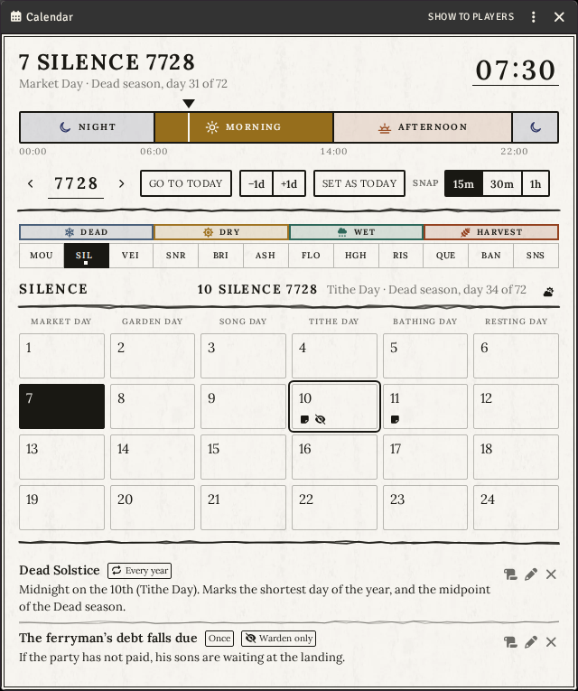
</p>

### Settings

Most of Cairn's rules have no on/off switch: they just apply. **Configure Settings** has only a
few options for this system:

- **Bestiary artwork** and **Bestiary artwork folder**: use your own pictures for the monsters in
  the Bestiary compendium (see [§17](#17-compendiums)).
- **Scene darkness follows the clock**: on by default; turn it off when a lighting module sets
  the darkness instead (see [The calendar and the watch](#the-calendar-and-the-watch)).
- **Actions menu macros → Choose macros**: drop macros here, and they appear in every character's
  **Actions** menu, run as that character (see [§3](#3-the-character-sheet)). A player sees only
  the ones they may run.
- **Cairn animations for Automated Animations**, shown only while that module is active (see
  below).

What a store charges and pays is set on each store (see [§11](#11-stores-and-coin)).

### Recommended modules

All three are optional:

- [Dice So Nice](https://foundryvtt.com/packages/dice-so-nice) rolls your dice in 3D, including a
  custom Cairn d20. The other dice wear the **Cairn Blood Moon** theme until a player picks
  another one in Dice So Nice's own settings.
- [Light Sources](https://github.com/brunocalado/light-sources) lights torches, lanterns and
  candles from the token's right-click menu and spends their uses as they burn. A lit torch is
  the torch itself: remove it from the sheet and it goes out, hand it to another character and it
  arrives lit, and a module that carries items onto the map, such as Canvas Loot, takes the flame
  with it.
- [Automated Animations](https://foundryvtt.com/packages/autoanimations), with
  [JB2A Patreon](https://jb2a.com/) and [PSFX](https://github.com/JimHPerry/psfx), animates and
  sounds Cairn's weapons, monster attacks and spells. The first time, the system's entries replace
  the module's Automatic Recognition menu, whose defaults are made for D&D; a later version only
  adds its new entries, so an entry you edit or delete stays that way. Turning the system's
  setting off stops any further changes.

### Other languages

The system is in English. A translation is a separate module, made by the community: install it
and pick its language in Foundry's settings. To make one, see [Translating Cairn 2e](translating.md).

---

## 2. Making a character

### The character creator

**Generate character** in the Cairn 2e tab opens a guided window with seven steps. Use **Back**
and **Next** to move between them:

1. **Background**: roll a d20 or pick one of the twenty from the list. Backgrounds the Warden wrote
   for this world are listed under **Other Backgrounds**, to pick by hand. The Background gives you
   a list of names, your starting gear and two small tables to roll on.
2. **Name**: pick one of the Background's names, roll one, or type your own.
3. **Attributes**: press **Roll 3d6 × 3**. If you like, pick two attributes and **Swap** them,
   once. Roll your **HP** here too. The help mark on each box says what it measures.
4. **Background tables**: roll each of the Background's two tables. When a result names an item,
   you get that item.
5. **Traits**: press **Roll all**, or roll the eight traits one by one.
6. **Bond**: roll a Bond and an age. Tick **Youngest character** if that is you, and you roll an
   **Omen** too. A roll fills the Bond's or the Omen's box, and what the box holds is what the
   character keeps: reword the roll, or write your own. When the Bond you roll names an item (the
   Strange Compass and 20gp, the Stone Heart), it is listed under the box and you get it. Rewording
   the Bond keeps the items; press the **×** beside one to leave it behind.
7. **Review**: check everything, then press **Create Character**. Anything you left blank is rolled
   for you.

<p align="center">
  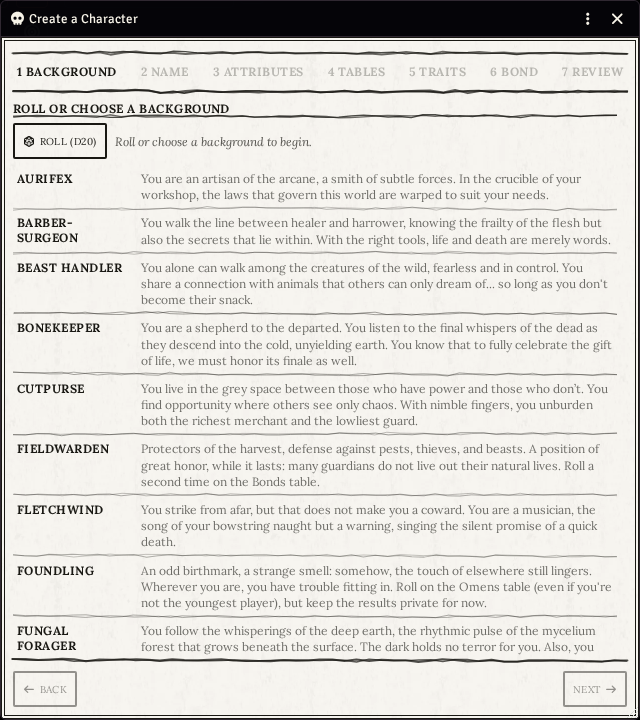
</p>

**Rolls that come with the Background.** Some Backgrounds roll a second time on the Bonds or Omens
table: the Foundling's **Omen** (whatever their age) and the Fieldwarden's **Second Bond**, at the
foot of their starting gear, and two table answers, the Outrider's *Always Pay Your Debts* and the
Mountebank's *False Prophet*. The creator rolls it when it makes the character and records it on
the **Growth** tab. A second Bond hands over what it names, like the first one, and its gold joins
the same sack.

**Rolled once.** A player's attribute roll, swap and HP roll are kept even if they close the
window, so closing it doesn't give a re-roll. The Warden can allow a new try from the character
sheet's menu (the cog icon): **Reset generator rolls**.

**Re-making an existing character.** The same window opens from a character sheet's menu
(**Generate Character**). There the last button is **Apply**. It replaces the character's name,
attributes, identity and items, and keeps their containers and what's in them. The Warden also has
**Regenerate** in that menu, which re-rolls the whole character at once after asking to confirm.

### Importing from Kettlewright

If you built your character in [Kettlewright](https://kettlewright.com), the Cairn companion app,
export it there as **JSON**. Then press **Import from Kettlewright** in the Cairn 2e tab and pick
the file. A new character is created and its sheet opens, followed by a short summary.

- It brings over the name, attributes, HP, gold, Background, Bond, Omen, age, traits, the
  Deprived and Panicked states, the portrait (when the export has a web address for it), and the
  items and containers. Kettlewright's *Main* is your ten slots, so it becomes no container;
  mounts and wagons go to your **Aside** tab, and a cart you pull takes its slots.
- Items with the same name as something in the compendiums become that exact item. Everything
  else is created from the file's own text.
- **Descriptions, notes and scars are not imported.** Copy those by hand.
- The import works **one way only** and does its best. Read the summary, then compare the sheet
  with the original.

### Your own Backgrounds

The Warden's Guide has a chapter on writing new Backgrounds (*Creating Backgrounds*). A Background
you write in the world is offered by the character creator under **Other Backgrounds**, below the
twenty in the book.

1. In the **Items** directory, create an Item of type **Background**. Fill in its blurb, its
   names, and its starting gold (every Background in the book uses `3d6`).
2. Drag its **starting gear** onto the sheet: items from a compendium or from your Items
   directory.
3. Make its **two tables** (d6 each) in the **Rollable Tables** directory and drag them onto the
   sheet. Lay out each row the way the book's do: a **text** result with the answer, and, when
   the answer is an item, a **document** result for that item on the same range. A row can grant
   several items, one document result each; a granted coin Item adds to the starting gold. Open any
   table in the *Background Tables* compendium to see one.

   **Type `1d6` in the table's Formula box, and never press Normalize.** With the box empty, the
   table counts every result as a face (six answers and six items roll a d12), and its first roll
   renumbers the rows one after another, so an answer no longer comes with its item. Leave
   **Draw with Replacement** ticked, as it is on a new table.
4. **Share it.** Players are offered the Background once it has **Observer** for them (right-click
   it → *Configure Ownership*). Until then it is yours alone, a draft only you see. Its tables and
   gear need no sharing.

**To change one of the twenty**, right-click it in the *Backgrounds* compendium, **Import**, and
edit the copy. The creator then offers your copy instead of the book's, in the list and on the d20
roll, and a Kettlewright import uses it too. Share it the same way.

The d20 roll only ever lands on the twenty in the book. A Background of your own is picked from
the **Other Backgrounds** list.

---

## 3. The character sheet

<p align="center">
  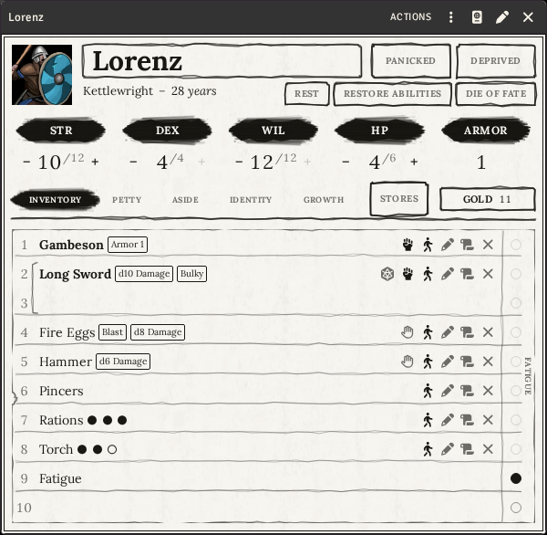
</p>

### The top of the sheet

- **Portrait and name.**
- **Background and age.** Drag a Background from the compendium onto its spot to set it.
- **Panicked** and **Deprived**: click one to turn it on or off.
- **Rest** restores lost HP. **Restore Abilities** restores STR, DEX and WIL to their maximum. Both
  are crossed out and refuse while you are **Deprived**, as the rules say.
- **Die of Fate** rolls a d6 in the open.
- **Actions**, in the sheet's title bar, opens a small menu for the character's owner:
  **Barter** (see below), the **Rules Summary**, the **Calendar**, **Whisper** (a private word, spoken as the
  character, to the players you pick) and any macros the Warden has added (see
  [§1](#settings)).

The **Rules Summary** puts the player's rules on one landscape page. The Warden can open it on
everyone's screen with **Show to everyone**, on its title bar.

<p align="center">
  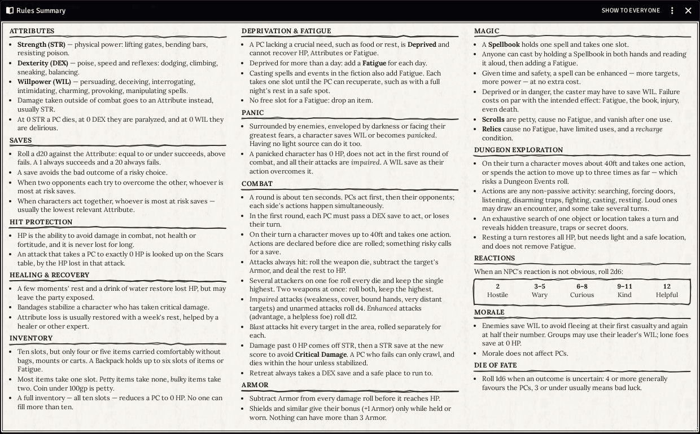
</p>

### Attributes and HP

**STR**, **DEX**, **WIL** and **HP** each show `current / max`. The **−** and **+** buttons change
the current value (hold one down to keep counting). Click the attribute's name to roll a save
(see [§5](#5-rolling-dice)).

**Armor** is worked out for you: it adds up the armor you have equipped, up to a maximum of 3.

### The edit window

The quill icon opens **Edit Character**. That's where you type things in: maximum attributes,
traits, Background answers, Bond, Omen and description. Press **Save** when you're done. The sheet
itself is for reading and playing at the table.

### Gold

The gold amount sits at the end of the row of tabs. Click it and type a new total. Coins are real
items that take space, so see [§11](#11-stores-and-coin) for how they are carried. While the
Warden lets players visit a store, a **Stores** button sits beside it.

### Tabs

| Tab | What it holds |
|---|---|
| **Inventory** | Your ten numbered slots. A *bulky* item takes two slots. Next to the slots is the **Fatigue** track: click an empty circle to take a Fatigue, which fills a slot, and click a marked one to clear it. |
| **Petty** | Two lists of things that take no slot. **Body** holds what is part of you: your fists (**Unarmed**, a d4 every character starts with), claws, a bite, armour grown into the skin. **Petty Items** holds small things you carry. |
| **Aside** | Things you own but aren't carrying, such as gear left at camp or on a mule. |
| **Identity** | Your Background answers, the eight traits, Bond, Omen and description. |
| **Growth** | Your Scars and your Growth: how the character has changed through play (see [§6](#6-damage-critical-damage-and-scars) and [§9](#9-growth)). |

**Too much to carry.** When all ten slots are full you are **Encumbered**, and your HP counts as 0
until you make room: the sheet shows a red **0**, and hovering it says why and what your real HP
is. That HP isn't lost: free a slot and it comes back. The Warden can also set or lift Encumbered
by hand from the token (see [§8](#8-conditions)). You can't pick up an eleventh slot's worth
at all, and a Fatigue with no free slot isn't added: drop something first. Panic shows the same
red 0 for as long as it lasts.

### Items on the sheet

Each item row has small buttons: **equip / unequip**, **use / restore a use**, **set aside** (it
moves to Aside, and the same button brings it back), **post to chat** and **delete**. A
weapon has a die button that rolls its damage.

**An item's description** is always open for whoever may edit it: click in it and type, and it is
saved when you leave the box. Anyone else reads it with its links working.

To add something, drag it from a compendium onto the sheet, or press **+** on a tab and pick a
kind: gear, weapon, armor, spellbook, scroll, relic, container or coin. The **+** on **Body**
offers only weapon, armor and gear, and what it makes is part of the body.

**Part of the body.** A thing with **Body** switched on costs no slot, is always to hand, and can never be
set aside, put in a container, handed over or sold. Unarmed is an ordinary item: rename it, give
it another die, or delete it. A weapon with **Paired** switched on rolls its die twice and keeps the higher,
which the rules write as *d8+d8*.

### Giving things to another character

- **Barter**, in the sheet's **Actions** menu, hands gear and coin to another player's character,
  or to your party's **Stash** (see [§10](#10-the-party)). Tick what goes, type an amount of coin,
  pick who gets it and press **Hand over**. Whatever doesn't fit on the other character stays
  with you, and a card in the chat says what changed hands.
- **Drag an item onto another sheet you own**, such as your hireling's or your mule's, to move it
  there. The Warden can do this between any two sheets.

Either way, a container goes with everything inside it. What is part of the body never changes
hands.

### What an item grants

A gear or a Growth can list the **actors and gear it comes with**: the Raven Familiar a Half-Witch
gains, the servant that comes with the Blood Pail. On a gear, press **Grants** on the **Add** row of its
Details tab; on a Growth, the **Grants** zone is on its Details tab. Drag an actor (not a party)
or a gear onto the dotted zone to add it, and the **×** on its row takes it off. Click a name to
open it.

**Drag a granted actor from its row onto the map** to bring it into play. An actor from a compendium
becomes one copy in the world, owned by the item's players, in a **Grants** folder of the Actors
directory, and its token is linked to it, so a companion wounded on one scene is wounded on the
next. Dragging the same row again sets another token of that same copy, not a second creature. An
actor already in the world's directory is put on the map as it is, and the item's players are made
its owners. The Warden has to be connected for a player's drag to work.

---

## 4. Items, magic and containers

### Magic

- **Spellbooks**: the cast button reads the spell aloud and adds a **Fatigue** for you. If you are
  **Deprived**, you are asked first: roll the WIL save, or cast without it if the Warden allows.
  With no free slot the spell still goes to chat, but no Fatigue is added and the card says an
  item must be dropped to cast it. What happens next is the Warden's call.
- **Scrolls**: petty (no slot), and they cause no Fatigue. Reading one uses it up, and you are
  asked to confirm first.
- **Relics**: cause no Fatigue and have a limited number of uses. Their sheet has a **Recharge**
  tab that says what brings the uses back.

### Containers

A container is an item that holds other items: a sack, a cart, a mule. A new character has no
container: their ten slots are everything they carry, and the story says how they carry it.

- To put something inside, drag it onto the container's row on your sheet, or onto the container's
  own window. The container's **Contents** tab lists what's inside and has a button to take things
  out.
- Drag an item anywhere else on the sheet to take it out again.
- A container can only hold things while someone carries it. It refuses anything that doesn't
  fit.
- A **Fatigue** never goes in a container: it always takes one of your ten slots.
- Deleting a container deletes what's inside too, and you are asked to confirm.
- **Takes Slots** decides whether the container uses your own slots. A backpack or a hand-pulled
  cart does. A horse, a mule or a wagon hauls itself, so it takes none and sits on your
  Aside tab.

The Gear compendium has a **Transport** folder with a **Cart** (4 slots), **Horse** (4), **Mule**
(6) and **Wagon** (8).

---

## 5. Rolling dice

| What | How |
|---|---|
| **Save** | Click **STR**, **DEX** or **WIL** on the sheet. You roll a d20 and need to roll equal to or under the attribute. A 1 always succeeds and a 20 always fails. |
| **Weapon damage** | Click the die on the weapon's row. A small window offers **Impaired** (a d4), **Enhanced** (a d12), **Blast**, and **Second weapon** (roll both weapons' dice and keep the highest). **Shift-click** skips the window. A Panicked attacker is always Impaired. Fighting unarmed is the **Unarmed** row on the Petty tab. |
| **Die of Fate** | The button at the top of a character sheet, or the macro. |
| **Reaction** | The button at the top of an NPC sheet, or the macro. It rolls 2d6 on the Reaction table, and the card goes to the Wardens only. |
| **Morale** | The button at the top of an NPC sheet, the flag on an opponent's row in the combat tracker, or the macro. It rolls a WIL save for the enemy, and the card goes to the Wardens only. Player characters never roll Morale. |

**One-click weapon macro.** Drag a weapon from your sheet onto the hotbar (the row of numbered
slots at the bottom of the screen). Clicking that slot rolls the weapon's damage.

---

## 6. Damage, Critical Damage and Scars

### Applying damage

1. Target the tokens that were hit. A targeted token is marked with ink brackets and a blood-red
   cross, and the pips that show other players' targets are larger and ringed the same way.
2. Roll damage. The Warden sees an **Apply damage** button on the chat card. **Shift-click** it to
   re-target instead.
3. The system takes the target's armor off the damage, removes it from HP, and carries whatever is
   left over onto STR.

The result card shows what happened. When STR was lost, the target's owner gets a **Roll STR save**
button on the card for Critical Damage, from whichever scene they are on. It rolls once per hit:
after the save, the button is gone. On a failure a character is incapacitated, a monster or NPC
is dead, and a **detachment** is routed or badly weakened instead. At STR 0 the target is dead.

<p align="center">
  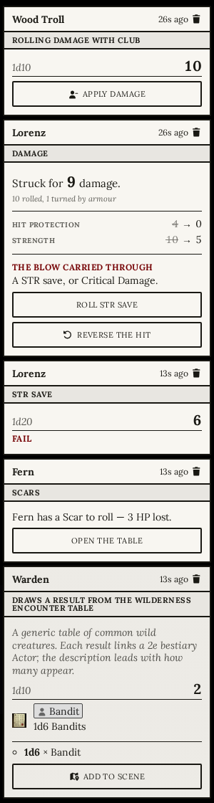
</p>

**Undoing a hit.** Applied it to the wrong token? The Warden can right-click the result card in the
chat and pick **Reverse the hit**. The HP and STR it took are given back.

### Traps

Damage from a trap comes off an attribute, usually STR or DEX, and not off HP. Write it into your
dungeon notes as a shortcut ([§15](#15-handy-shortcuts-in-text)), for example `[[/damage d6 STR]]`.
Target the characters it hits and click it. The card offers two buttons:

- **Apply to STR**: armor reduces the damage, as usual.
- **Apply to STR, armour does not help**: for a trap armor can't stop, like poison gas.

Armor only helps a trap when it makes sense, so the Warden picks the button. HP never moves. At DEX
0 the character is paralyzed, at WIL 0 delirious, and at STR 0 dead. **Reverse the hit** gives the
attribute back.

### Any roll as damage

A fall, a cave-in or a d6 the Warden rolls on the spot has no weapon behind it. Roll it in chat
(`/r 2d6`), target the tokens it hits, then press **Apply as damage** under the roll (right-clicking
the roll offers the same entry, on any roll). A small window asks where it lands: **HP**, like an
ordinary hit, or **STR**, **DEX** or **WIL**, like a trap. Armor always counts against HP, so the
**Armour helps** switch is locked on there; for an attribute you choose, because a shield does not
stop noxious gas. With several tokens targeted, each takes the whole roll, minus its own armor,
and gets its own **Damage** card in the log. Each of those cards has a **Reverse the hit** button
(also on its right-click menu), so the one target that should not have been hit is undone alone.
The Scars work exactly as for a weapon. Only the Warden sees these buttons and entries.

### Scars

When a hit takes a player's character to **exactly 0 HP** without touching STR, that player gets
the **Scars** window. The right row of the Scars table is already chosen. Roll where it landed,
then press **Take this Scar**.

Some Scars only give their benefit later, for example "once mended". Those wait on the **Growth**
tab, where you roll the benefit when the Warden agrees the time has come. **Add a Scar** on the
same tab records a Scar that no hit produced. Deleting a Scar puts any maximum it raised back where
it was.

---

## 7. Combat

Cairn has no initiative. Each round the adventurers act, then their opponents. The combat tracker
is built around that:

- It shows two groups, **Adventurers** and **Opponents**, instead of an initiative list.
- Each row has a button to **mark it as having acted** this round. Players can mark their own
  characters.
- The group that still has to act is written in full ink, and every token of that group is marked
  on the map.
- In the **first round** each player character has a button to roll the **DEX save** the rules ask
  for. Anyone who fails loses that turn.
- Every opponent's row has a **Morale** flag, the Warden's alone, that rolls that opponent's
  Morale save at any moment.
- When the opponents owe a Morale save (their first casualty, half their number down, or a lone
  foe at 0 HP), the Warden is whispered one reminder. It rolls nothing: the flag does. Players
  don't see it.

The same tracker also runs a dungeon, turn by turn: see [§14](#14-exploring-a-dungeon).

---

## 8. Conditions

Right-click a token and open its conditions list. The system replaces Foundry's usual list with
Cairn's ten conditions, each with its name beside the icon:

**Critical Damage · Dead · Delirious · Deprived · Doomed · Encumbered · Fatigued · Fleeing ·
Panicked · Paralyzed**

- **Fatigued** is set by the system for characters, from their Fatigue items. It can't be
  switched on by hand for a character.
- **Encumbered** is set by the system when all the slots are full, and taken off when one frees
  up. The Warden can also switch it on or off by hand, for a load the slots don't show. While it
  is on, the character (or NPC) has 0 HP; their real HP comes back when it is lifted.
- **Panicked** makes the character count as having 0 HP and makes all their attacks Impaired.
- **Doomed** comes from one row of the Scars table. **Fleeing** marks an enemy that failed its
  Morale.
- The rest are markers you set yourself. They remind the table, and the rules are yours to run.

---

## 9. Growth

In Cairn, characters change through what happens to them, not through experience points. The
**Growth** tab is where that is recorded.

1. When the Warden says the character has grown, press **Add a Growth** on the Growth tab. (A
   Growth can't be dragged in from elsewhere: it is earned in play, or comes with the Background;
   see [§2](#the-character-creator).)
2. A Growth can have **milestones**, a list of steps to tick off, on its Details tab. The help mark
   on its Description explains how Downtime Milestones and their Costs work; write the Costs in
   the description.
3. When it pays off, press **Record the gain**. Either pick which maximum it changes (HP, STR, DEX
   or WIL) and to what, or write the gain in words (for example "no longer needs Rations").

Deleting a Growth puts back any maximum it changed.

---

## 10. The party

A **Party** is a special kind of actor that holds the group together. Create one in the Actors
directory like any other actor and choose **Party** as its type.

- **Drag characters onto its sheet** to add them. The order of the list is the **marching order**;
  drag rows to change it.
- The sheet has three tabs: **Party** for the player characters, **Followers** for hirelings,
  mounts and other companions, and **Stash**. Each row on the first two shows that member's HP,
  attributes, armor and load at a glance. Click a name to open their sheet.
- **The Stash** is what the group holds and nobody carries: treasure found and not yet shared out,
  a sack of coin, the spare rope. Drop gear or coin on the party's sheet and it lands in the
  Stash tab, listed like the things on a character's Aside tab.
  - **It weighs on nobody.** The party has no slots, so the Stash has no limit, and nothing in it
    counts against any member's ten. Gear in the Stash is never equipped, and what is part of
    a body cannot go in.
  - **Members take things out by dragging** them onto their own sheet, where the ten slots apply
    as always, or by **Barter** (below). Either way a container goes with everything inside it.
  - **Barter** sits beside the Stash's name. A member hands gear and coin from their character to
    the party, and takes them back out of the party to a character, through the same window as
    on a character sheet (see [§3](#giving-things-to-another-character)). The party is offered
    only to characters on its list. Whatever doesn't fit on the character stays in the Stash.
  - **The Stash is open to the players by default**, because they own the party. A Warden who
    wants it closed lowers the party's ownership (its default permission, as for any actor): a
    player who can only observe it sees the Stash but is not offered Barter.
- **Press P** to open the active party's sheet from anywhere. To choose which party is active,
  right-click it in the Actors directory and pick **Make this the active party**. (You can change
  the key under **Configure Controls**.)
- **The party token.** Put the party's token on the map to travel as one piece. Right-click it to
  **Gather the party in** (the members' tokens go into the party token) or **Set the party down**
  (they come back out around it). A member can be held back from travelling with the party with
  the button on their row.

<p align="center">
  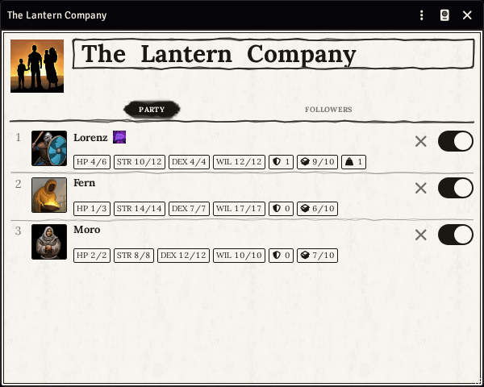
</p>

---

## 11. Stores and coin

### Coin

Coins are items. There is one sack per place: one on your body, one in each container, one on
your Aside tab.

- **Spending** takes coins from your body first, then from containers you carry, then from what's
  further away (the mule, the sack left at camp).
- **Gaining** puts coins on your body if they fit. If they don't, you are asked which container
  should take them. Only containers with room for the whole amount are offered.
- A sack of less than 100 gold is petty and takes no slot. Every full hundred takes one slot, and
  the system won't let a pile of gold overflow your slots.

### Stores

The Warden opens **Store** from the Cairn 2e tab.

A new world already has ten small stores: **Weaponsmith**, **Armorer**, **Stables**,
**Provisioner**, **Outfitter**, **Apothecary**, **Toolmaker**, **Curiosities**, **Tailor** and
**Tavern**. Between them they sell everything in the rulebook's Marketplace except Ship's Passage,
plus some of the **More Gear** compendium; the Tailor (but its Gloves) and the Tavern are all More Gear. They are
only a starting point: rename them, restock them or delete them like any store you made. The
Warden's **Restore Default Stores** macro brings all ten back as they first were, and deletes
every other store, after a warning.

**For the Warden:**

- **New** makes a store. Give it a name.
- Fill its shelves by dragging items, or a **whole folder** of items, from a compendium or the
  Items directory. The **×** on a row takes it off the shelf.
- **Settings** sets what this store charges (100% is the book price, more is expensive, less is a
  sale) and what it pays when buying from characters (it starts at 50%, the usual half).
- **Players can visit**, also in Settings, lets players walk into the store on their own. The ten
  stores a world starts with have it on; a store you make starts with it off. A door beside the
  store's name shows which: open when players can visit, shut when they cannot.
- Prices come from the items themselves. To change a price everywhere, edit the item.
- **Open to players** opens the store on every player's screen.

**For players:**

- While the Warden lets you visit at least one store, a **Stores** button sits beside your Gold on
  your character sheet. It opens the store, and the list at the top of the window moves between
  every store you can visit. Moving to another store empties your cart.
- The Warden can also open a store on your screen with **Open to players**. It joins your list until
  you close the window, even if it is not one you can visit on your own.
- The **For sale** tab lists the shelves. The **Yours** tab lists your own things that have a
  price. Both are in alphabetical order.
- Add things to the **cart** with **+** or by dragging them. The bottom of the window adds up the
  **gold** and the **slots** you'd need.
- **Confirm** stays greyed out, with the reason, while you are short of coin or the things won't
  fit. Once it goes through, the gold and items are moved for you.

<p align="center">
  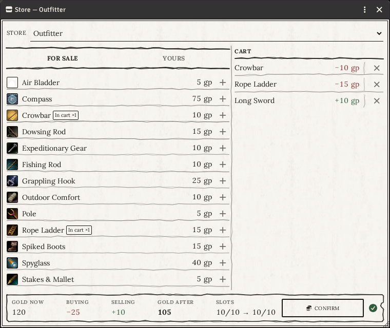
</p>

---

## 12. Warden tools

The generators are in the **Generators** section of the Cairn 2e tab. Only the Warden sees them.

### Generate NPC / Generate Hireling

One click creates a complete NPC: name, attributes, HP, appearance, a quirk, a goal, a virtue and
a vice, plus a Background (for an NPC) or a **career and daily wage** (for a hireling). It also
gets a few basic items (Rations, a Torch, a weapon, armor, and a hireling's work tools), so its
Armor is real.

**The NPC sheet** has **Roll Morale**, **Roll Reaction** and a **Detachment** switch. A detachment
is a large group fighting as one: its attacks are Enhanced and hit everyone nearby (Blast), and
attacks against it are Impaired. Failing a Critical Damage save routes it instead of killing it.

- **Edit window.** Each identity field has a die that rolls just that field. **Randomize** rolls
  them all, and **Save** keeps the result.
- **Tabs.** **Items**, **Features** (special abilities), **Identity** and **Description**.
- **Menu (cog icon).**
  - **Re-roll NPC** rolls new stats but keeps the name, picture, token, description and any items
    you added by hand.
  - On a hireling, **Promote to Player Character** turns them into a full character and can hand
    them to a player, for example after a character dies.

### Generate Monster

Pick how tough it is: **Standard** (3 HP, d6 attack), **Hardier** (6 HP, d8), **Serious** (10 HP,
d10) or **Random**. You get a hostile monster with an attack, its special abilities as Features,
and sometimes armor. **Re-roll Monster** in the sheet's menu rolls new stats, attack and features,
and keeps the name, picture, token, description and any items you added by hand.

### Generate Faction

Rolls the Faction tables and writes the result as a page in a journal called **Factions**, named
by the book's Faction Names Formula (*The Crimson Covenant*, *Guild of the Withered Thorn*). Every
new faction is another page there, and each page can be shown to the players on its own.

A faction page is a form you keep up to date as the campaign goes:

- **Type and traits**, **Advantages**, **Agents** (in order of rank), an **Agenda** of goals you
  tick off as they are achieved, and **Obstacles**. Each list has a die that rolls a new entry
  from its table.
- **Drag an actor** onto the page to make it an agent. Its WIL is read straight from its sheet.
  **Drag an item** onto the page to make it an advantage.
- **Drag an agent** onto another to change their rank. The top agent rolls when the faction is
  opposed.
- **Faction action** rolls what the faction does this time, and tells you whether it gains or loses
  something. You then edit the page to match.
- **Opposed save**: when two factions clash, the one most at risk rolls WIL with its top agent. On
  a fail, it doesn't act this time.

Both rolls go to the Wardens only.

<p align="center">
  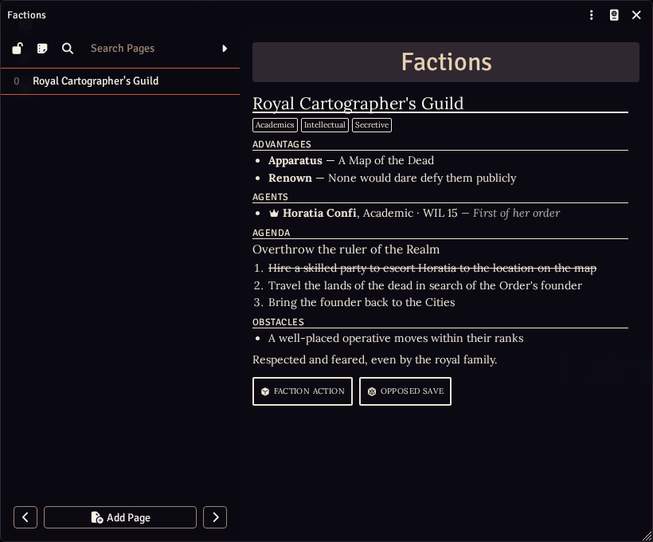
</p>

### Generate Name

Opens the **Name Generator**, the Warden's Guide's Naming Procedures with one tab each: **Place**
(type the kind of place: Gulch, Fort, Lake…), **Terrain** (pick a terrain; its synonyms stand in
for the place), **Faction**, **Realm** and **Forest**.

- The window shows the name, then how it was built: the formula and each word, with the die it
  came from. The die beside a part rolls that part again and nothing else.
- On **Realm**, choose a dominant terrain and each adjective and noun can be swapped for one of its
  synonyms (*The Misty Bluffs*).
- **Add "the"** switches the formulas' optional "(The)" and "of (the)" on and off without rolling
  again.
- **Copy** puts the name on the clipboard; **Whisper** sends it to the Wardens only, so the table
  hears it when you say it. **Recent** keeps the last eight names; click one to bring it back.
- Every word comes from the **Warden Tables** compendium (Name Formula, Name Adjective, Name Noun,
  Terrain Synonym, Group Type, Ruler Type, Faction and Ruler Name Formula, Forest Adjective and
  Forest Noun), so you can roll any of them with `[[/table …]]`, and an imported copy you edit is
  the one the generator uses.

<p align="center">
  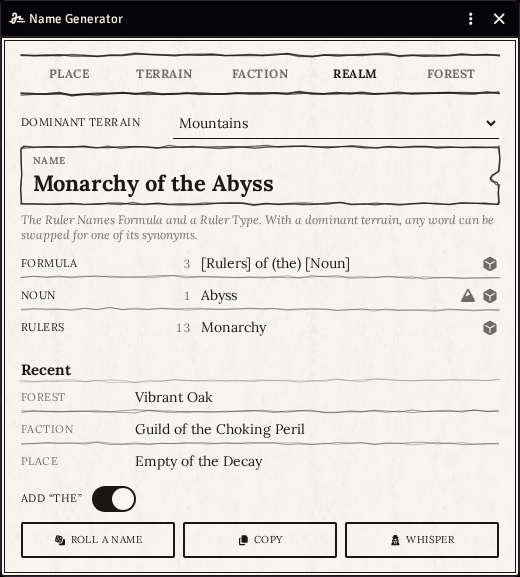
</p>

### Treasure

**Treasure**, in the **Generators** section, opens a window where the Warden rolls loot and sends
it to the active party's **Stash** (see [§10](#10-the-party)). The Cairn 2e book has no treasure
table: it says a treasure is specific to where it is found, and that it tells a story. So this is
a table aid, not a rule. Its defaults are the price bands of the system's own compendiums, and it
invents nothing.

- **Roll on** lists what can be rolled, each with a switch and a number for how many times it is
  drawn (1 to 10). A new world offers **Coin**, the four **Valuables** bands, the three **Relics**
  bands, the two **Scrolls** bands and the two **Spellbooks** bands, all switched off. The window
  remembers what you switched on and how many.
- **Choose your sources.** Drag a **Roll Table**, or a **folder of Items**, from a compendium or
  the sidebar onto the list to offer it. The **×** takes a source off the list; it never deletes
  the table or the folder. A folder is read with its subfolders, and only gear is drawn from it.
  A table is rolled like any other, so a result that points at another table follows it.
- **Coin** is rolled by a dice formula in gold pieces. It starts as `3d6*10`, a choice for
  this tool and not the rulebook's: it lands between 30 and 180 gold, so a roll often crosses the
  100 gold where a sack stops being petty and starts to weigh. Type another formula in its field;
  one that isn't a dice formula is not kept.
- **Roll** adds to the **Drawn** list instead of replacing it. A table result that is gear or coin
  becomes that gear or coin, a text result becomes a gear with that text for its name (so a table of
  your own art objects works, and you can edit the name once it is sent), and anything else is left
  out, with a notice saying how many.
- **Strike it** (the **×** on a row) throws away a row you don't want, and **Clear** throws away
  all of them. Then roll again, if you like: what you kept stays. Closing the window drops
  whatever is drawn.
- **Send** names the party it writes to (**Send to** *the party's name*). It puts everything
  still drawn into the Stash and empties the list. Which party that is, is the **active party**
  (see [§10](#10-the-party)). Anything the party can't hold stays drawn, with a notice.
- **The card.** Sending posts a card in the open chat, saying what was found and with an **Open
  the Stash** button that opens the party's sheet on its Stash. It only tells the table: it holds
  nothing, and nothing is handed over by it. The button is hidden from anyone who can't see the
  party. Players take what they want from the Stash itself.
- **With no active party**, the window says so and **Roll** and **Send** are held back. **Create
  a party** makes one, and the first party in a world becomes the active one by itself.

A Warden's macro can open it with `cairn2e.treasure();`.

### Unknown gear

A thing a character finds is not always one they understand ("When a character first acquires a
Relic they are not familiar with…", Warden's Guide, Knowledge). Any gear can be hidden this way: a
relic, a strange potion, a sword with a past. The **eye** in the item sheet's title bar, the
Warden's alone, hides it from its holder. A **Guise** tab then opens, where you write what they
see in its place: the name they call it (**Known as**), its **Picture**, and its appearance.

- Until it is revealed, every player sees the guise: on the sheet, in Barter, in a Store, inside a
  container and in any chat card about it. Its die, armor, charges and Recharge are not shown.
- It **cannot be used**: no equip, no charges, no damage, no post, no hotbar macro, and its sheet is
  read-only. The holder can still carry it, set it aside, stow it, hand it over or drop it, but
  not sell it in a Store.
- A store's shelf can sell a gear that is unknown: the buyer sees its guise and pays its price.
- Experimenting with it is a conversation: the player says what they try, and you rule — a WIL save
  if the fiction wants one.
- You see the real name everywhere, with an **Unknown to them** tag. The eye again reveals it and
  posts a card saying what it turned out to be.
- The real data never leaves the client, so a player who opens the console can read it. This is a
  table tool, not a lock.

<p align="center">
  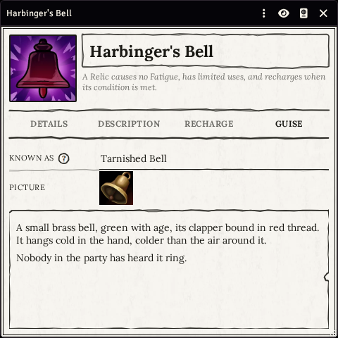
  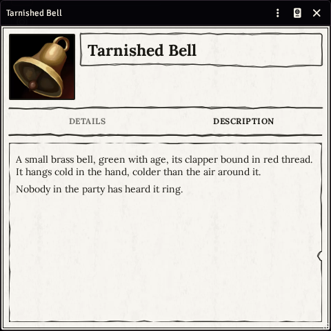
</p>

### Encounters from tables

When the Warden rolls an encounter table and a result names creatures ("1d4 Wolves"), the chat
card gets an **Add to scene** button. It rolls how many there are, brings the creature in from the
Bestiary, and places neutral tokens in the middle of your view. A "random NPC" result creates a
fresh NPC instead. The button works once per card.

Meeting a creature is not fighting it, so roll a **Reaction** to see how it goes.

### Using your own tables

Every table the Warden tools roll on (NPC, monster, faction, travel and encounter tables) can be
replaced with your own. **Import** the table from the **Warden Tables** compendium into your world
(right-click it and choose Import, or drag it into the Roll Tables sidebar), then edit your copy:
the generators use yours instead. You can rename your copy, and it survives system updates.

A table you build from scratch is not picked up, even with the same name. Start from ours and
change it.

---

## 13. Journeys through the wilderness

**Journey** in the Cairn 2e tab opens a window, shared with everyone, that runs travel watch by
watch.

### Setting out

The Warden picks the **path** (road, trail or wilderness), the **distance**, the **terrain**, the
**season**, and up to two extra watches for especially vast land. Then press **Begin the journey**.
A card appears in the chat with an **Open the journey** button for everyone. **Show to everyone**
opens the window on every player's screen.

**Who travels.** Drag characters, hirelings, mounts or a whole party onto the window. The **×** on a
row takes someone off the journey, and nothing the journey does touches them after that.

Only an actor whose token is **linked** can travel. Generated NPCs, hirelings and monsters, and
creatures added from an encounter, get unlinked tokens: each token is its own copy, so the journey
would have no single sheet to take Rations from or give Fatigue to. Dropping one shows a warning
and leaves it off. To bring it along, tick **Link Actor Data** in its prototype token settings (and
on any of its tokens already on the map), then drag it in again. A party brings in its linked
members and names the ones it left behind.

### Each watch

A day has three watches: morning, afternoon and night. The journey starts on the watch it is now
(see [The calendar and the watch](#the-calendar-and-the-watch)) and moves it on each time a watch is
spent. The **Day** it shows counts the days of the journey.

1. **Weather** is rolled automatically each morning. The Warden can pick it by hand instead, or
   press **Auto** to roll again. When the weather costs something, buttons offer to add a Fatigue
   to the party or a watch to the journey. The weather table says "or", so that choice is the
   Warden's.
2. **Choose what the party does**: Travel, Explore, Supply or Make Camp. The group decides
   together at the table and the Warden picks it.
   - **Travel** asks for a roll to see whether the party gets lost.
   - **Supply** asks for a foraging roll, or offers **Resupply at a settlement**.
   - Players can make these rolls too.
3. **Spend the watch.** The button only works once everything needed has been rolled. It then
   updates the sheets for you:
   - **Make Camp** eats one Ration per person and clears their Fatigue. Anyone with no Ration
     becomes Deprived.
   - **Supply** hands out the Rations found.
   - **Travel** moves the party closer, or finds the way again if they were lost.

**Events.** After each watch a **Wilderness Event** is rolled and shown in the journey window. The
Warden can roll it again. When the event is an **Encounter**, the creatures and their Reaction come
with it. The Warden's **Put them on the map** button lets them click where the creatures appear
(Escape cancels).

**A night without camp** costs everyone a Fatigue and makes them Deprived, and the next day's
terrain is harder. Whenever the party takes a Fatigue, from the weather or from a night without
camp, a chat card says who took it and who had no free slot for it. Those characters must drop an
item to take it. The **±** buttons at the top let the Warden adjust the watches needed or
travelled by hand. **End the journey** closes it for everyone.

Left to the Warden and the table: mounts, guides and maps, and how an encounter plays out.

<p align="center">
  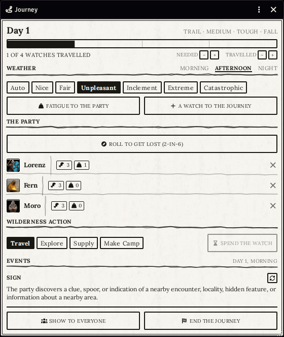
</p>

### Routes on a map (pointcrawls)

For a map with marked places, create a **Route** page in a journal for each road. Set its path,
distance, terrain and season, and the two places it links. Then add a map pin (a Note) on the road
that points to that page.

When the Warden **double-clicks the pin**, the Journey window opens with that road already filled
in. Players who double-click it just read the page. The page also has its own **Begin the journey**
button.

---

## 14. Exploring a dungeon

A dungeon runs in the **combat tracker**, one turn at a time. Any dangerous place counts: a ruin, a
manor house, a cave. The tracker keeps count and reminds you of the rules. It never stops anyone
from doing anything, and the Warden decides what happens.

### Starting

Press the **dungeon** button beside the **+** at the top of the combat tracker. Add the party's
tokens the usual way (right-click a token and **Toggle Combat State**), then press **Begin
Exploring**. The tracker counts **turns**, and **Next Turn** starts a new one. If someone moved
past torchlight this turn and no Dungeon Event was rolled, it asks first. The glyph beside it ends
the exploration.

### Each turn

- Each row has a line for what that character **does this turn**. Players fill in their own
  character's line. The **list** button beside it offers the actions from the rules (search,
  listen, force a door, move quickly…), each with its rule written under its name; picking one
  writes it on the line, and the line stays free text, so anything goes.
- A **Panicked** character also finds **Shake off panic** in that list: it rolls the WIL save,
  and on a success the condition ends.
- Beside the name is **how far the token has moved** this turn: green within torchlight's 40 ft,
  amber and bold with a running figure past it, red past the 120 ft an action covers. Moving
  further is allowed; it means the party is moving quickly. Moved too far? The **undo** arrow
  beside the distance takes the token back to where the turn began, for its owner and the Warden.
- The switch at the end of the row marks the character as having acted, as in a fight.
- A new turn clears the lines, the marks and the distances.
- The help mark at the top of the tracker sums up the turn; clicking it opens the Rules Summary.

<p align="center">
  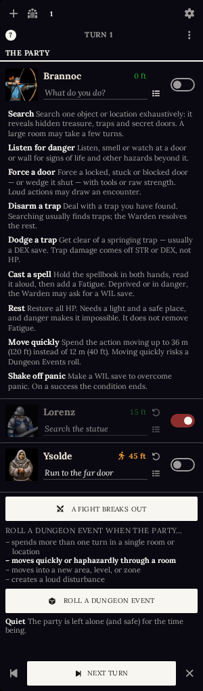
</p>

### Dungeon Events

Under the party, the Warden sees when the rules call for a roll on the **Dungeon Events** table:
when the party stays too long in one place, moves quickly, enters a new area, or makes noise.
"Moves quickly" lights up by itself when a token has gone past 40 ft. The other three are the
Warden's call.

**Roll a Dungeon Event** rolls the table. The card goes to the Warden only, and the result stays in
the tracker until the next turn. On **Exhaustion**, the party chooses:

- **Each adds a Fatigue** gives every character a Fatigue.
- **Each eats a ration** spends one Ration use from each character.
- To rest instead, use the **Rest** button on each sheet.

The card says who had no free slot or no ration left.

### When a fight breaks out

**A Fight Breaks Out** starts an ordinary fight with the party already in it. Add the monsters and
fight as usual. When the fight ends, the tracker goes back to the dungeon on the same turn, with
everything as it was.

---

## 15. Handy shortcuts in text

Anything you write in a journal, an item or NPC description, or a chat message can contain these
shortcuts:

| Type this | You get |
|---|---|
| `[[/save WIL]]` | a button that rolls a WIL save for the selected token (or your character). Also works with `STR` and `DEX`. |
| `[[/save STR]]{Resist the cold}` | the same, showing your own words on the button |
| `[[/table Reactions]]` | a button that rolls on the named table: your own tables first, then the system's |
| `[[/table Compendium.cairn2e.tables.RollTable.…]]` | the same, pointing at the table by its UUID (open the table and choose **Copy Document UUID** in its window menu). The button shows the table's name, and it still works if the table is renamed or translated. |
| `[[/damage d6 STR]]` | a button that rolls a trap's damage against the targeted tokens' STR instead of their HP ([Traps](#traps)). Also works with `DEX` and `WIL`, and with any dice, such as `2d6`. |
| `[[/damage 2d6 DEX]]{Falling stones}` | the same, showing your own words on the button |
| `@Condition[deprived]` | the condition's name. Hover it to read what it means. |
| `@Rule[panic]` | the rule's name. Hover it to read the rule. |

Rules you can name with `@Rule[...]`: `panic`, `impaired`, `enhanced`, `deprived`, `fatigue`,
`detachment`, `morale`, `critical-damage`.

---

## 16. Macros

A new world imports the **Macros** compendium into a **Cairn 2e** folder of the Macros
directory, and fills each player's hotbar on their first login (see [§1](#a-new-world)). The
players can run the macros marked below; the rest are the Warden's. The compendium stays open to
everyone, so a macro can also be dragged from it onto the hotbar.

| Macro | What it does | Players |
|---|---|---|
| **Die of Fate** | rolls a d6 | ✓ |
| **Rest** | restores lost HP | ✓ |
| **Restore Abilities** | restores STR, DEX and WIL to their maximum | ✓ |
| **Rules Summary** | opens the one-page rules summary | ✓ |
| **Calendar** | opens the Vald calendar | ✓ |
| **STR**, **DEX**, **WIL** | roll that save | ✓ |
| **Roll Morale** | rolls a Morale save for the selected enemy | |
| **Roll Reaction** | rolls 2d6 on the Reaction table | |
| **Reset Player Hotbars** | puts the player macros back in their slots on every player's hotbar, leaving the other slots alone | |
| **Restore Default Stores** | after a warning, replaces every store with the system's ten as they first were | |

Each macro works on the **selected token**. With nothing selected, it works on **your own
character**. Die of Fate and Reaction roll even with neither.

Importing happens once per world: a folder the Warden deletes does not come back.

### Writing your own

Each of these is one line, so you can build your own macro: create a **Script** macro and type
one of these lines.

```js
cairn2e.rest();             // restore HP
cairn2e.restoreAbilities(); // restore STR, DEX and WIL
cairn2e.save("DEX");        // a save: "STR", "DEX" or "WIL"
cairn2e.morale();           // a Morale save for the selected NPC
cairn2e.reaction();         // 2d6 on the Reaction table
cairn2e.dieOfFate();        // 1d6
cairn2e.rulesSummary();     // open the rules summary
cairn2e.calendar();         // open the calendar
cairn2e.treasure();         // Warden only: open the Treasure window
cairn2e.resetPlayerHotbars(); // Warden only: refill every player's hotbar
cairn2e.restoreDefaultStores(); // Warden only: every store back to the system's ten
```

---

## 17. Compendiums

The **Compendium Packs** tab holds everything the game needs, in a **Cairn 2e** folder:

| Folder | Packs |
|---|---|
| **Character Creation** | Backgrounds, Background Tables, Background Gear, Companions, Character Traits, Bonds, Omens |
| **Equipment** | Gear, Weapons, Armor |
| **Magic** | Spellbooks, Scrolls, Relics |
| **Reference** | Player's Guide, Game Tables, Bestiary, Hirelings, Vald Calendar |
| **Warden** | Warden Tables |
| **Homebrew** | More Gear, More Spellbooks, More Scrolls: extra content by the system's author, not from the Cairn book |

**Macros** sits at the top of the folder.

- Compendiums are **read-only**. To use something, drag it onto a sheet, onto the map, or into your
  world.
- Only the Warden sees the **Bestiary**, so players can't read the monster stats.
- **Companions** holds the creatures some backgrounds start with (the Blood Pail's servant, the
  Falcon, the Hollow Wolf, the Homunculus, the Raven Familiar). The item that grants one lists it
  under **Grants** (see [§3](#what-an-item-grants)).

**Monster pictures.** The Bestiary comes with Foundry's standard icons. To use your own art:

1. Create a folder under your Foundry `Data` folder (by default `cairn2e-assets`) with two
   subfolders, `portraits` and `tokens`.
2. Name each file after its monster, for example `Blink-Dog.webp`.
3. Turn on **Bestiary artwork** in the settings.

The compendium itself is never changed. Turn the setting off and the standard icons come back.
